# Language school
This is a comprehensive language school management application designed to streamline administrative tasks and enhance learning experiences for both students and teachers. Built with .NET and C#, this application provides a user-friendly interface for managing courses, scheduling classes, tracking student progress, and organizing school operations. This application is suitable for language schools of all sizes, offering key features that simplify enrollment, attendance tracking, and communication.

## Tech Stack
- **Frontend and Backend**: .NET Framework with Windows Forms and WPF (Windows Presentation Foundation) for a modern, responsive desktop UI.
- **Database**: Local SQL Server LocalDB.
- **Authorization**: Role-based access to ensure secure login.

## Installation and Setup
To run this project locally, follow these steps:

1. Clone the repository:
   git clone repository-url.

2. Set up the database:
Create a new database and configure the connection string in the Models/Data.cs file.
Execute Resources/skriptaGenerisanjeTabela.sql for creating tables.

3. Run the application:
Build and run the application.

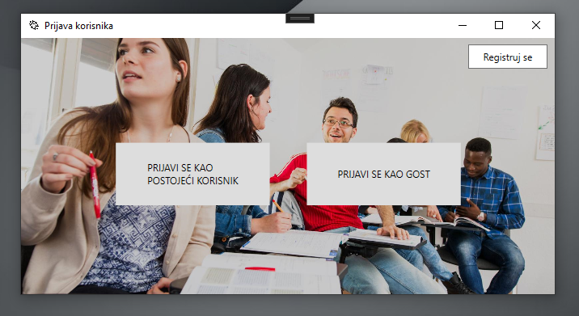
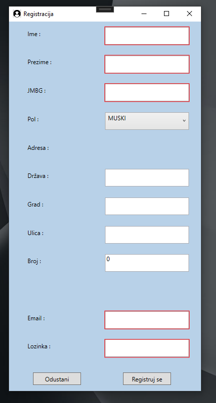
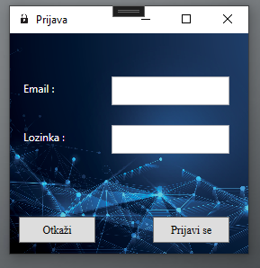
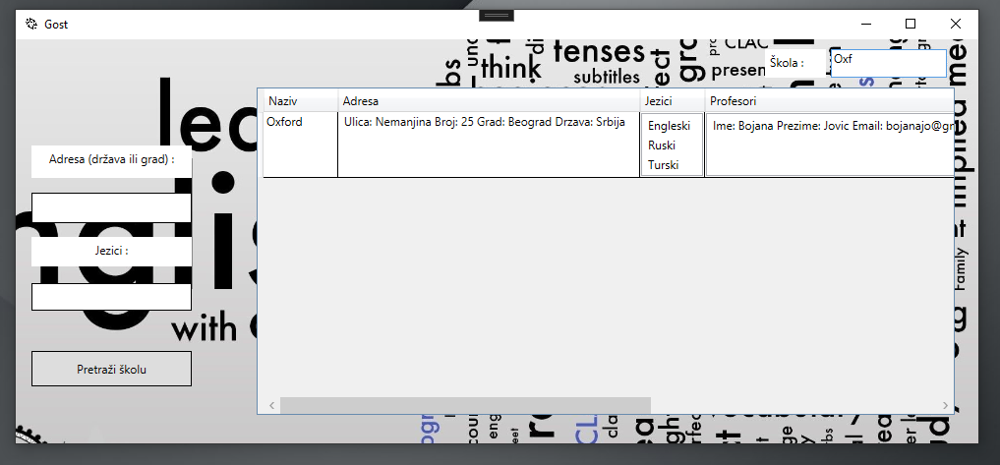
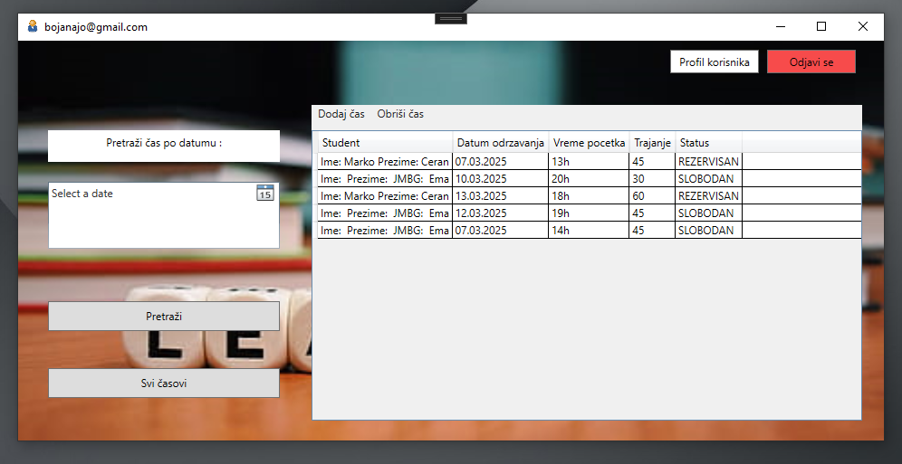
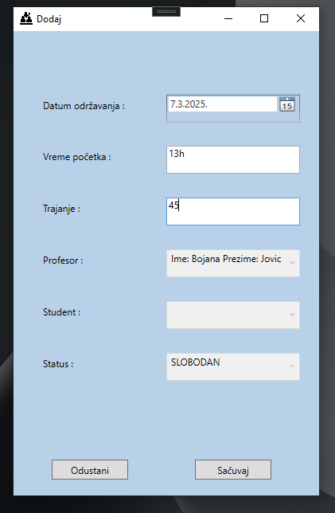
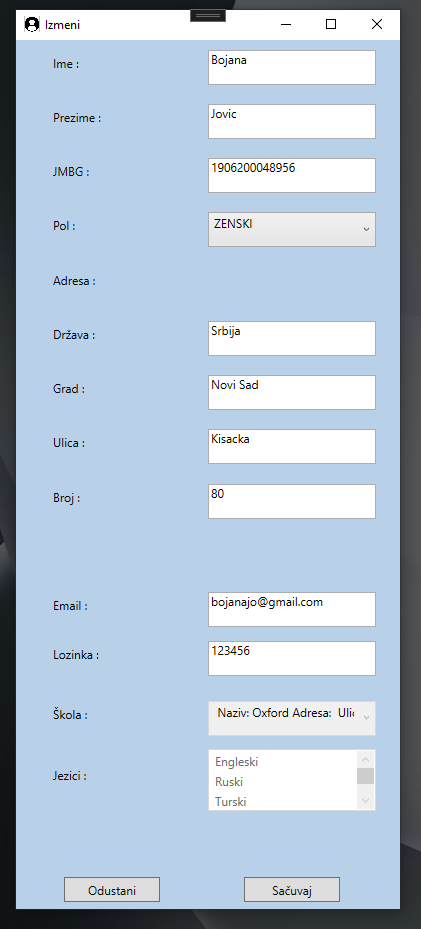
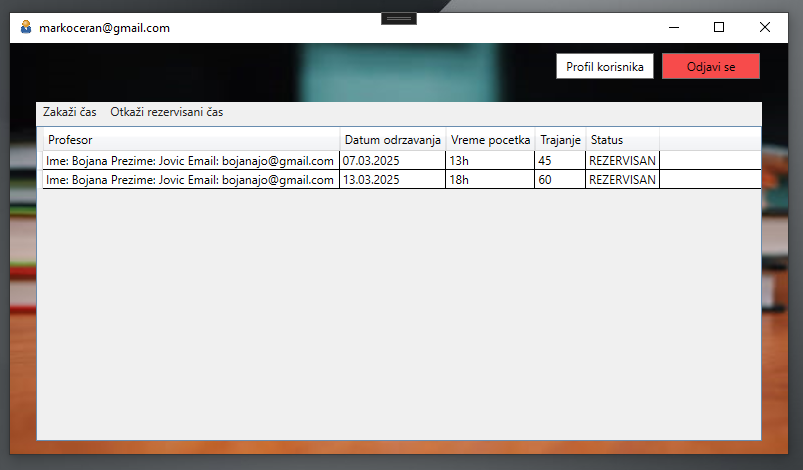
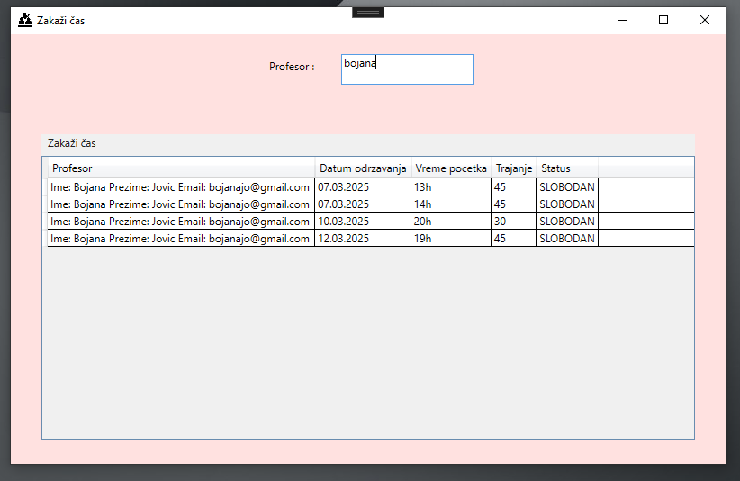
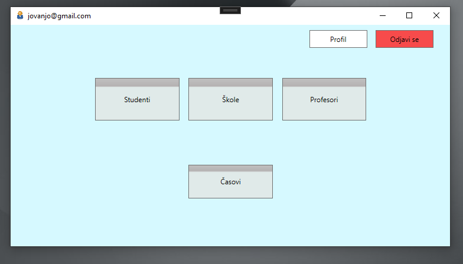
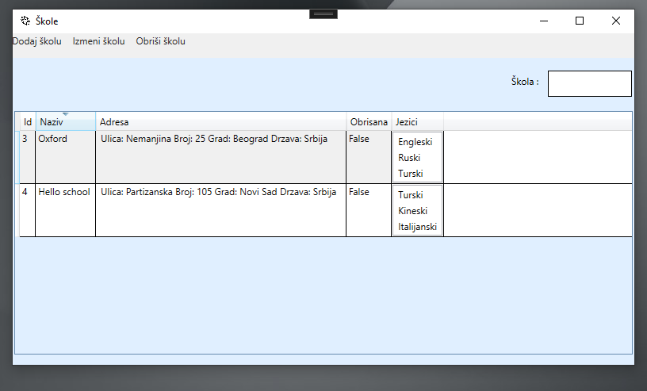
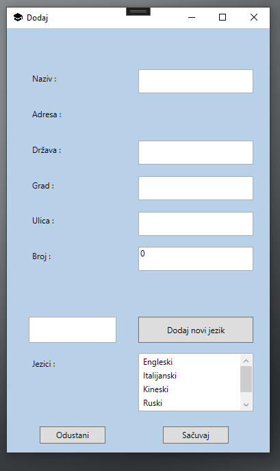
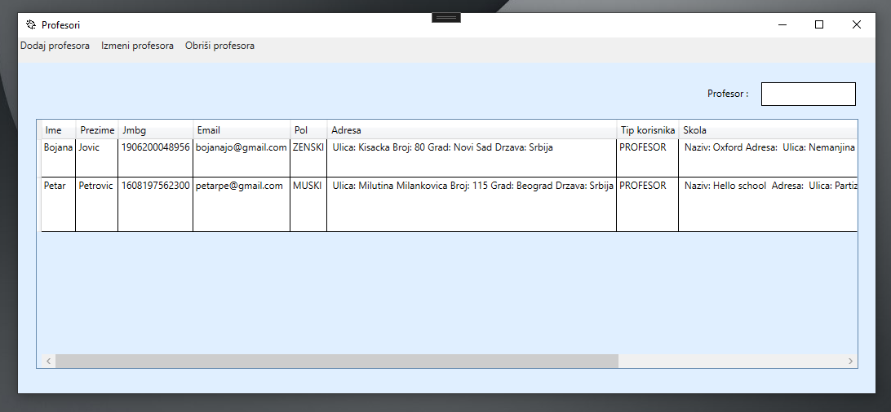
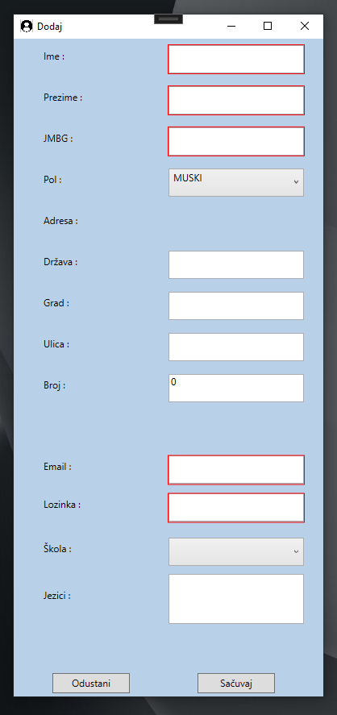
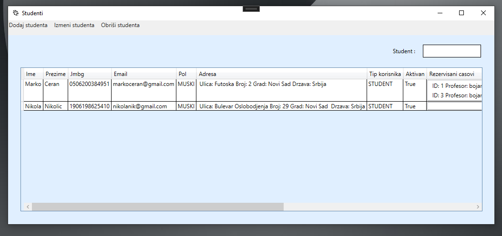
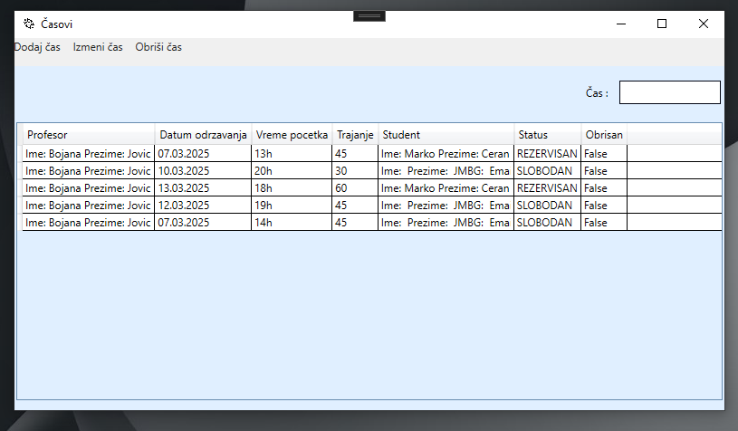
